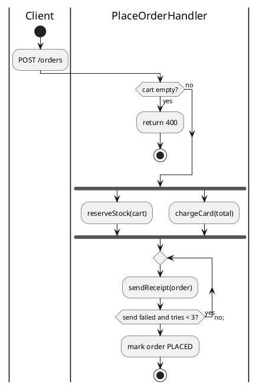

# Activity diagram

Shows one flow as steps: what runs, where it branches, what repeats, what runs
side by side, and who does each step. Draw one flow, the one with the most
branches, loops or parallel steps, and say in `why` which it is and why.

## Notation

Use PlantUML's new activity syntax, the one with `:action;`.

| Element | PlantUML | Meaning |
|---|---|---|
| Start | `start` | Where the flow begins. |
| Stop and end | `stop`, `end` | `stop` ends the flow; `end` ends it early, as an error or a cut-off. The theme gives both the final-state colour. |
| Action | `:reserveStock(cart);` | One step. An action can run over several lines until the `;`. |
| Branch | `if (guard?) then (yes)` ... `elseif` ... `else (no)` ... `endif` | One of several paths, picked by the guard. |
| Loop, test last | `repeat` ... `repeat while (guard?) is (yes) -> no;` | Runs the body, then tests. Use it for retries. |
| Loop, test first | `while (guard?) is (yes)` ... `endwhile (no)` | Tests, then runs the body. |
| Parallel | `fork` ... `fork again` ... `end fork` | Paths that run at the same time and join at the bar. |
| Swimlane | `\|Name\|` on its own line | Who does the steps that follow: a class, a service, a person. |
| Flow label | `-> label;` between two steps | Names the path. Use it only when the label says more than the arrow. |
| General notes | `legend bottom` ... `endlegend` | Notes about the whole flow. |

## Choosing the flow

Pick a flow the code runs with real branches, loops, parallel steps or
several actors: a command handler that validates and rejects, a job that
retries, a checkout that charges and reserves at once. Name it in `why` and
give the reason in one sentence. If the code has only straight call paths,
draw the sequence diagram instead and give this one the no-basis note.

## Budget

At most about 12 actions and 15 arrows. The page counts each action as an
element and each path out of a branch, fork or loop as an arrow. Past the
budget, fold private helper calls into the step that calls them, and say what
you cut in `omitted`.

## Anti-patterns

| Anti-pattern | Why it hurts | Instead |
|---|---|---|
| Several flows in one diagram | The reader cannot tell which path belongs to which flow | One flow; mention the others in `why` if they matter. |
| One action per line of code | Buries the branches under steps | One action per step a reader would name. |
| Branches the code does not have | Invents behaviour | Draw the guards the code tests, in its words. |
| The legacy syntax (`(*) --> "step"`) | Mixed with the new syntax it will not parse | Use `start`, `:step;` and `stop`. |
| A swimlane per class for a flow that stays in one | Adds columns and no meaning | Use swimlanes only when the flow crosses actors. |
| States drawn as actions | "Paid" is a condition, not a step | Put the lifecycle in the state diagram. |
| A note floating in the body | It sits on top of the flow | Put general notes in `legend bottom` ... `endlegend`. |
| Over the budget | Past about 12 actions the flow runs off the page | Keep the steps that carry the flow, and fill in `omitted`. |
