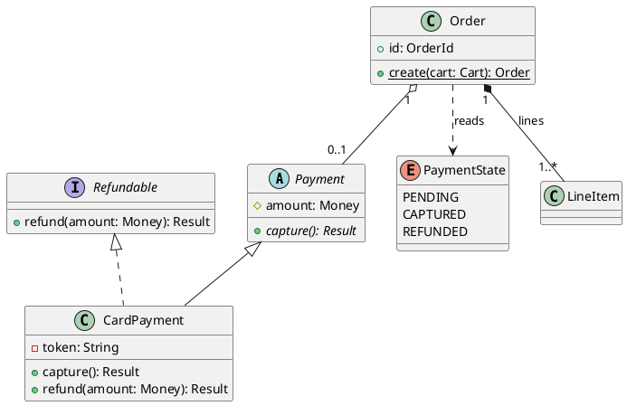

# Class diagram

Shows the types in the system, what each one holds and does, and how they
relate. It is the diagram most readers open first, so it carries the names
the code uses.

## Notation

| Element | PlantUML | Meaning |
|---|---|---|
| Visibility | `+` public, `-` private, `#` protected, `~` package | Who can reach the member. |
| Static member | `{static}` | Belongs to the type, not an instance. |
| Abstract member or type | `{abstract}`, `abstract class` | Has no body here; a subtype supplies it. |
| Interface | `interface Name` | A contract with no state. |
| Enum | `enum Name` | A closed set of values. |
| Inheritance | `Base <\|-- Sub` | Sub is a kind of Base. |
| Realization | `Contract <\|.. Impl` | Impl fulfils the interface. |
| Composition | `Whole *-- Part` | The part lives and dies with the whole. |
| Aggregation | `Whole o-- Part` | The whole holds the part, which can outlive it. |
| Association | `A -- B`, `A --> B` | A knows B; the arrow gives the direction of navigation. |
| Dependency | `A ..> B` | A uses B briefly, such as a parameter or a return type. |
| Multiplicity | `"1" -- "0..*"` | How many on each end: `1`, `0..1`, `*`, `1..*`, `n..m`. |
| Role or label | `A -- B : owner` | Names the link. |

The theme colours the letter badge by kind: interfaces, abstract classes and
enums each get their own colour. It also colours arrows by kind:
inheritance and realization, composition and aggregation, association, and
dependency each get their own. Do not add colours by hand.

## Anti-patterns

| Anti-pattern | Why it hurts | Instead |
|---|---|---|
| Every class in the repo on one canvas | Nobody can read a hundred boxes | Draw the central domain; leave out helpers, DTOs and framework glue. |
| Over the budget | Past about 15 arrows or 12 classes the lines tangle | Keep the types that carry the design, and say what you left out in `omitted`. |
| A note floating in the body | It sits on top of arrows | Put notes about the whole diagram in `legend bottom` ... `endlegend`. |
| Every getter and setter listed | Hides the members that matter | Show the fields and methods that carry the behaviour. |
| Composition used for any "has a" | Claims a lifetime rule the code does not keep | Use composition only when the part cannot exist without the whole. |
| No multiplicity on associations | The reader cannot tell one from many | Put multiplicity on both ends of every association that has one. |
| Inheritance drawn where the code composes | Misstates the design | Draw what the code does, not what it could do. |
| Names changed to sound nicer | The reader cannot find them in the code | Use the names in the code, as written. |
