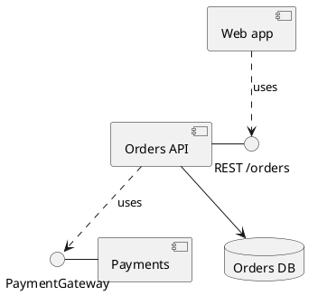

# Component diagram

Shows the system's replaceable parts — services, modules, libraries — and the
interfaces they offer and need. It sits above the class diagram: a box here is
a unit you could build, ship or swap on its own.

## Notation

| Element | PlantUML | Meaning |
|---|---|---|
| Component | `component [Name]` or `[Name]` | A unit with a clear boundary. |
| Provided interface | `C - I` (lollipop) | C offers I. |
| Required interface | `C ..> I` | C needs I. |
| Dependency | `A ..> B` | A uses B. |
| Port | `port`, `portin`, `portout` inside a component | A named point of contact. |
| Grouping | `package`, `node`, `folder`, `frame` | Puts components in a layer or subsystem. |

## Anti-patterns

| Anti-pattern | Why it hurts | Instead |
|---|---|---|
| Classes drawn as components | Mixes levels | A component is a module, package, service or library, not one class. |
| Dependencies with no interface | Hides the contract | Name the interface, route or API the link goes through. |
| Every third-party package | Buries the system's own parts | Show external parts only where the system depends on them directly. |
| Cycles left unmarked | A cycle is a design fact worth seeing | Draw it, and mention it in a note. |
