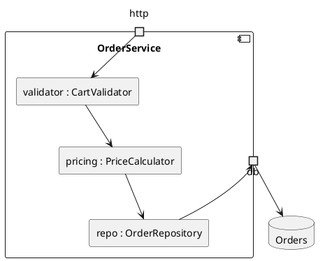

# Composite structure diagram

Shows the inside of one class or component at run time: the parts it holds,
the ports it talks through, and the connectors between them. It answers "what
is this made of, and how are the pieces wired?" where a class diagram answers
"what types exist?".

## Notation

| Element | PlantUML | Meaning |
|---|---|---|
| Structured classifier | `component Name { }` or `rectangle Name { }` | The class or component whose inside is shown. |
| Part | `rectangle "role : Type"` | An instance the whole owns, named by its role. |
| Port | `portin`, `portout`, `port` | A point where the whole meets the outside. |
| Connector | `a --> b` | A link that carries calls or data between parts, or from a part to a port. |
| Collaboration use | `usecase "Name" as c` inside the whole, with dashed links | A named pattern the parts take part in. Use sparingly. |

## Anti-patterns

| Anti-pattern | Why it hurts | Instead |
|---|---|---|
| A class diagram drawn again | Adds nothing | Show one whole and the instances inside it, named by role. |
| Several wholes on one canvas | Loses the point of the view | One structured classifier per diagram; pick the one with the most parts. |
| Parts with no connectors | The reader cannot tell how they cooperate | Draw how each part reaches the next. |
| Ports for every method | Clutter | A port is an entry point the outside uses: an HTTP handler, a queue, a callback. |
| A whole the code does not wire | Invents structure | Draw a class or module that builds its own collaborators, or give the no-basis note. |
