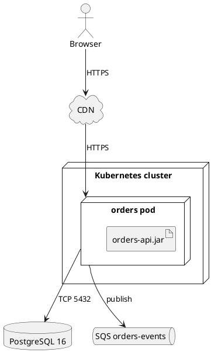

# Deployment diagram

Shows where the software runs: the machines, containers and managed services,
which artifacts go on each, and how they talk. In code, look for Dockerfiles,
compose files, Kubernetes manifests, Terraform, CI deploy steps and
serverless configs.

## Notation

| Element | PlantUML | Meaning |
|---|---|---|
| Node | `node "Name"` | A device or run-time environment: a host, VM, pod, container. |
| Nesting | `node A { node B { } }` | B runs inside A. |
| Artifact | `artifact "file"` | A built thing that is deployed: a jar, an image, a bundle. |
| Managed services | `database`, `queue`, `cloud`, `storage` | Infrastructure the system uses but does not run itself. |
| Communication path | `A --> B : protocol` | A network link; label it with the protocol or port. |

## Anti-patterns

| Anti-pattern | Why it hurts | Instead |
|---|---|---|
| Infrastructure guessed from the language | Invents machines | Draw only what deploy files or config state; otherwise give the no-basis note. |
| Links with no protocol | The reader cannot tell how they talk | Label each path: HTTPS, gRPC, TCP 5432, publish. |
| Components drawn instead of nodes | Mixes views | Nodes are where things run; the artifact names what runs there. |
| Every environment at once | Repeats the same picture | Draw production, or the one environment the files describe, and note the others. |
