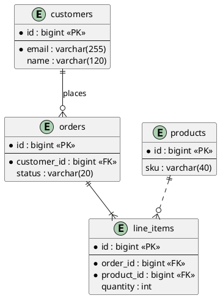

# Entity-relationship diagram

Shows the tables, or the entities an ORM maps to them, their columns and keys,
and how many rows on one side match how many on the other. It is not a UML
diagram; PlantUML draws it in information engineering notation, with crow's
feet.

## Notation

| Element | PlantUML | Meaning |
|---|---|---|
| Entity | `entity orders { ... }` | A table, or the entity an ORM maps to one. |
| Key columns | above `--` | The primary key, marked `<<PK>>`. |
| Other columns | below `--` | Each `name : type`, as the schema writes them. |
| Mandatory column | `*` before the name | `NOT NULL`, or a field the ORM marks required. |
| Foreign key | `<<FK>>` after the type | A column that points at another entity's key. |
| Exactly one | `\|\|` | One and only one row on this side. |
| Zero or one | `\|o` or `o\|` | At most one row, maybe none. |
| One or many | `}\|` or `\|{` | At least one row. |
| Zero or many | `}o` or `o{` | Any number of rows, maybe none. |
| Identifying | `--` | The child's key includes the parent's key, or the child cannot exist without it. |
| Non-identifying | `..` | The child points at the parent but stands on its own. |
| Label | `customers \|\|--o{ orders : places` | Names the relation. Use it only when it says more than the line. |

The theme draws entities like classes. Do not add colours by hand.

## Where the basis comes from

Read migrations, SQL DDL (`CREATE TABLE`), ORM entities and models (`@Entity`,
`@Table`, TypeORM, Sequelize, Prisma `schema.prisma`, Django or Rails models).
Take entity and column names, types and keys as written there, and the
multiplicity from foreign keys, `NOT NULL`, unique constraints and the ORM's
relation decorators. A repo with none of these has no basis: give the
no-basis note.

## Budget

At most about 12 entities and 15 relation lines. The page counts each
`entity` as an element and each crow's-foot line as an arrow. Past the budget,
keep the entities the domain turns on, show only key and foreign-key columns
for the rest, and say what you cut in `omitted`.

## Anti-patterns

| Anti-pattern | Why it hurts | Instead |
|---|---|---|
| Columns the schema does not have | Invents data the reader will look for | Use the columns the migration, DDL or entity declares, as written. |
| Names changed to sound nicer | The reader cannot find them in the schema | Keep `line_items`, not `LineItem`, when the table is `line_items`. |
| Every column of every table | Hides the keys | Show keys, foreign keys and the columns that carry the design. |
| Multiplicity guessed | Claims a rule the schema does not keep | Read it from `NOT NULL`, unique constraints and foreign keys. |
| Class diagram notation (`*--`, `<\|--`) | Mixes two notations | Use crow's feet: `\|\|--o{` and the like. |
| Join tables drawn as a line | Hides the columns the join holds | Draw the join table as an entity when it has columns of its own. |
| A note floating in the body | It sits on top of lines | Put general notes in `legend bottom` ... `endlegend`. |
| Over the budget | Past about 12 entities the lines tangle | Keep the core entities, and fill in `omitted`. |
