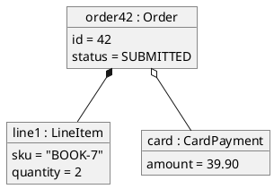

# Object diagram

Shows a snapshot: particular instances, the values in their fields, and the
links between them at one moment. It makes a class diagram concrete. In code,
look for fixtures, seed data, test builders and examples in docs.

## Notation

| Element | PlantUML | Meaning |
|---|---|---|
| Object | `object "name : Type" as alias` | One instance, named and typed. |
| Slot | `field = value` inside the object | The value it holds at this moment. |
| Link | `a -- b`, `a *-- b`, `a o-- b` | An instance of an association from the class diagram. |
| Map | `map "Name" as m { key => value }` | A dictionary-shaped instance. |

## Anti-patterns

| Anti-pattern | Why it hurts | Instead |
|---|---|---|
| Values made up | Presents fiction as fact | Take the values from fixtures, seeds, tests or the description; otherwise give the no-basis note. |
| A class diagram with values pasted in | Loses the point of a snapshot | Show named instances and the links between them. |
| Links the class diagram does not allow | Contradicts the model | Every link matches an association, with its multiplicity. |
| Dozens of instances | Unreadable | Show the smallest set that makes the structure clear. |
