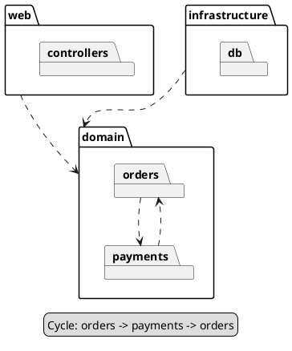

# Package diagram

Shows how the code is grouped — folders, modules, namespaces — and which groups
depend on which. It is the diagram for layering rules and dependency cycles.

## Notation

| Element | PlantUML | Meaning |
|---|---|---|
| Package | `package "name" { }` | A group of elements with a shared namespace. |
| Nesting | a package inside another | A sub-module or sub-folder. |
| Dependency | `A ..> B` | Something in A uses something in B. One arrow per pair, however many imports. |
| Merge | `A ..> B : <<merge>>` | A takes B's contents as its own. Rare in code; the label says more than the arrow, so keep it. |
| Other groupings | `folder`, `frame`, `namespace` | Change the icon; the meaning is the same. |
| General notes | `legend bottom` ... `endlegend` | Cycles and other notes about the whole diagram. |

Keep a package diagram to about 15 arrows and 12 packages. The theme draws
groups with a dashed border and dependencies as dashed grey curves.

## Anti-patterns

| Anti-pattern | Why it hurts | Instead |
|---|---|---|
| One package per file | That is a file tree, not a design view | Group by module or layer, two or three levels deep at most. |
| One arrow per import | Forty arrows between six packages hide the layering | One arrow per pair of packages. |
| A barrel `index` pointing at everything | It re-exports, so it adds arrows and no design | Leave barrel and re-export files out, and say so in `omitted`. |
| `<<import>>` on every arrow | It repeats what the dashed arrow already says | No label, unless it says more than the arrow's kind. |
| Dependencies drawn from intent | Hides the real coupling | Draw the dependencies the imports show. |
| Cycles hidden | They are the most useful thing this view shows | Draw every cycle, and list them in the legend. |
| A note floating in the body | It sits on top of arrows and gets in the layout's way | Put general notes in `legend bottom` ... `endlegend`. |
| Over the budget | Past about 15 arrows or 12 packages the lines tangle | Draw the layers that matter, and say what you left out in `omitted`. |
| `skinparam linetype ortho` or `polyline` | Elbows stack on top of each other and cross packages | Leave the lines as curves. |
| Classes inside packages | Turns it into a class diagram | Leave classes to the class diagram. |
