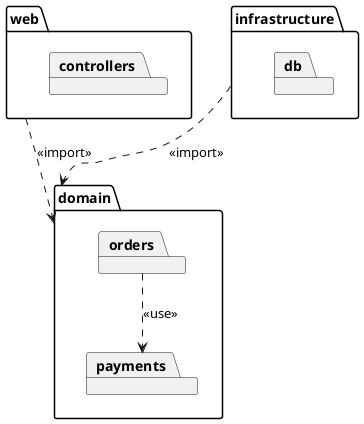

# Package diagram

Shows how the code is grouped — folders, modules, namespaces — and which groups
depend on which. It is the diagram for layering rules and dependency cycles.

## Notation

| Element | PlantUML | Meaning |
|---|---|---|
| Package | `package "name" { }` | A group of elements with a shared namespace. |
| Nesting | a package inside another | A sub-module or sub-folder. |
| Dependency | `A ..> B` | Something in A uses something in B. |
| Import | `A ..> B : <<import>>` | A pulls B's public names in. |
| Merge | `A ..> B : <<merge>>` | A takes B's contents as its own. Rare in code. |
| Other groupings | `folder`, `frame`, `namespace` | Change the icon; the meaning is the same. |

## Anti-patterns

| Anti-pattern | Why it hurts | Instead |
|---|---|---|
| One package per file | That is a file tree, not a design view | Group by module or layer, two or three levels deep at most. |
| Dependencies drawn from intent | Hides the real coupling | Draw the dependencies the imports show. |
| Cycles hidden | They are the most useful thing this view shows | Draw every cycle, and mention it in a note. |
| Classes inside packages | Turns it into a class diagram | Leave classes to the class diagram. |
