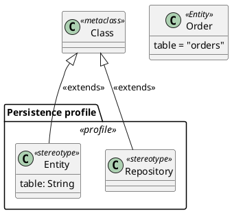

# Profile diagram

Shows the stereotypes a system adds on top of plain UML: the custom kinds of
class it uses, what they extend, and the tagged values they carry. In code,
look for decorators, annotations, marker interfaces and base classes a
framework gives meaning to, such as `@Entity`, `@Controller` or `@Injectable`.

## Notation

| Element | PlantUML | Meaning |
|---|---|---|
| Profile | `package "Name" <<profile>> { }` | The set of stereotypes. |
| Stereotype | `class Name <<stereotype>>` | A new kind of element. |
| Metaclass | `class "Class" as M <<metaclass>>` | The UML element the stereotype extends. |
| Extension | `M <\|-- S : <<extends>>` | The stereotype applies to that metaclass. |
| Tagged value | a field on the stereotype, a value on the use | Data the stereotype carries, such as a table name. |
| Applied stereotype | `class Order <<Entity>>` | A model element marked with it. |

## Anti-patterns

| Anti-pattern | Why it hurts | Instead |
|---|---|---|
| A profile invented from ordinary classes | Suggests meta-modelling the code does not do | Give the no-basis note when the code has no decorators, annotations or framework markers. |
| Every decorator in the dependency tree | Most are the framework's, not the system's | Show the markers the system's own classes use. |
| Stereotypes with no metaclass | The reader cannot tell what they apply to | Draw the extension to the metaclass. |
| Tagged values left out | Hides what the marker configures | Show the arguments the code passes to it. |
