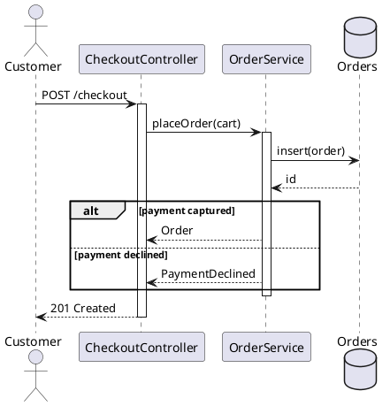

# Sequence diagram

Shows one flow over time: who sends what to whom, in what order, and what comes
back. Draw one flow, the central one, and say in `why` which it is and why it
was chosen.

## Notation

| Element | PlantUML | Meaning |
|---|---|---|
| Participant | `participant`, `actor`, `database`, `queue`, `boundary`, `control`, `entity` | Something that sends or receives messages; the keyword sets the icon. |
| Synchronous message | `A -> B : call()` | A waits for B. |
| Asynchronous message | `A ->> B : event` | A does not wait. |
| Return | `B --> A : value` | The reply. |
| Self call | `A -> A : step()` | A calls itself. |
| Activation | `activate A` / `deactivate A` | A is busy handling a call. |
| Create and destroy | `create B`, `destroy B` | The participant's life starts or ends here. |
| Alternatives | `alt` / `else` / `end` | Only one branch runs. |
| Optional | `opt` / `end` | Runs only when the guard holds. |
| Loop | `loop each item` / `end` | Repeats. |
| Parallel | `par` / `else` / `end` | Branches run at the same time. |
| Critical and break | `critical`, `break` | A region that must not be split, or one that ends the flow. |
| Reference | `ref over A, B : Login` | Points at another sequence instead of drawing it. |
| Note | `note over A, B : text` | A remark on part of the flow. |

## Choosing the flow

Pick the flow that most of the system's work passes through, or the one that
touches the most classes in the class diagram: checkout in a shop, a request
through its middleware in a server, a job run in a worker. Name it in `why`
and give the reason in one sentence. With a description, take the flow the
description spends the most words on.

## Anti-patterns

| Anti-pattern | Why it hurts | Instead |
|---|---|---|
| Several flows in one diagram | The order of events stops meaning anything | One flow; mention the others in `why` if they matter. |
| Every private call drawn | Buries the conversation between parts | Show calls that cross a class or service boundary. |
| No returns | The reader cannot tell what came back | Draw the return whenever the caller uses it. |
| Fragments nested three deep | Unreadable | Split with `ref`, or draw the happy path and name the rest in a note. |
| Participants named by type only | Hides which instance is which | Use the role the object plays, with its type if needed. |
| A flow the code does not have | Invents behaviour | Trace a real call path, or give the no-basis note. |
