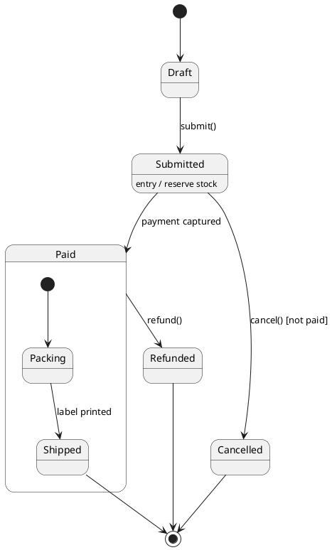

# State diagram

Shows the states one entity passes through and the events that move it from
one to the next. Draw one entity, the one with the richest lifecycle, and say
in `why` which it is and why.

## Notation

| Element | PlantUML | Meaning |
|---|---|---|
| Initial state | `[*] --> A` | Where the entity starts. |
| Final state | `A --> [*]` | Where its life ends. The theme gives final states their own colour. |
| Transition | `A --> B : event [guard] / action` | The event moves it from A to B when the guard holds, running the action. |
| Composite state | `state A { ... }` | A state with its own sub-states. |
| Entry, exit, do | `state A : entry / x` | Work done on entering, leaving or while in the state. |
| Choice | `state c <<choice>>` | One of several paths, picked by guards. |
| Fork and join | `state f <<fork>>`, `state j <<join>>` | Split into, or merge, parallel regions. |
| History | `[H]`, `[H*]` | Return to the last sub-state. |
| Concurrent regions | `--` inside a composite state | Parts of the state that change on their own. |

## Choosing the entity

Pick the entity with a status field, an enum of states or a set of guarded
methods: an order, a payment, a job, a connection. Name it in `why` and give
the reason in one sentence. If nothing in the source has more than two states,
give the no-basis note.

## Anti-patterns

| Anti-pattern | Why it hurts | Instead |
|---|---|---|
| Activities drawn as states | "Validating" is work, not a state the entity rests in | States are conditions that hold over time; name them with adjectives or past participles. |
| No initial state | The reader cannot tell where it starts | Every diagram has one `[*] -->`. |
| Transitions with no event | The reader cannot tell what causes them | Label every transition with the event, the guard, or both. |
| Several entities in one diagram | Mixes lifecycles | One entity per diagram. |
| Every flag drawn as a state | Explodes the diagram | Draw the states the code branches on. |
